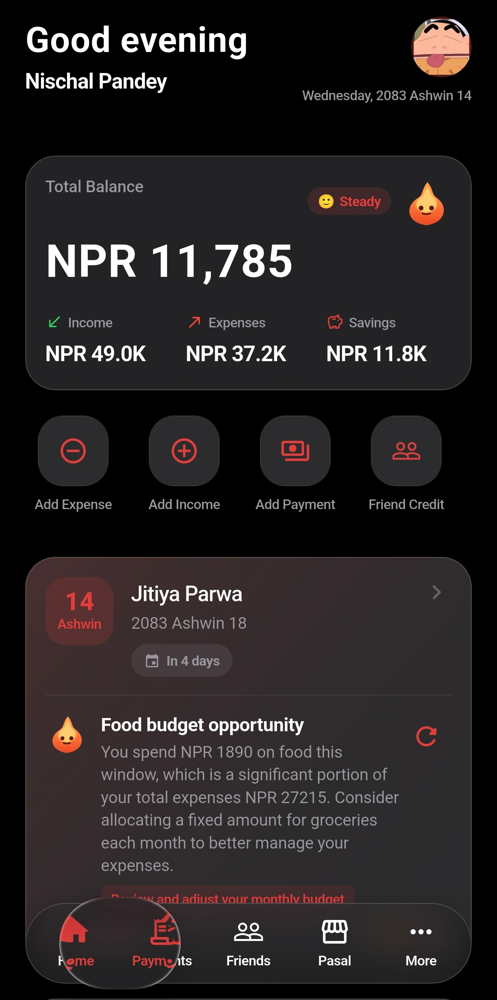
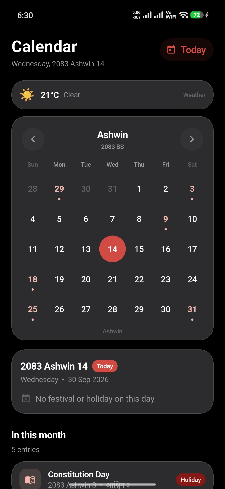
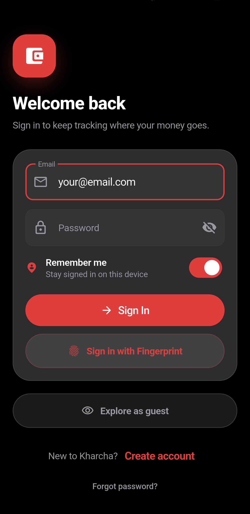
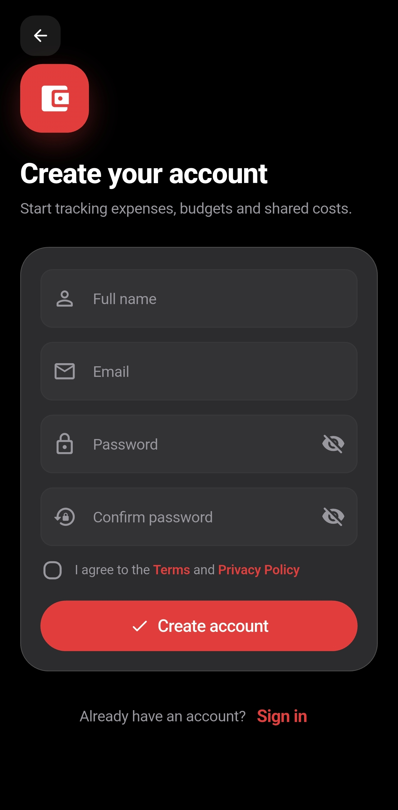
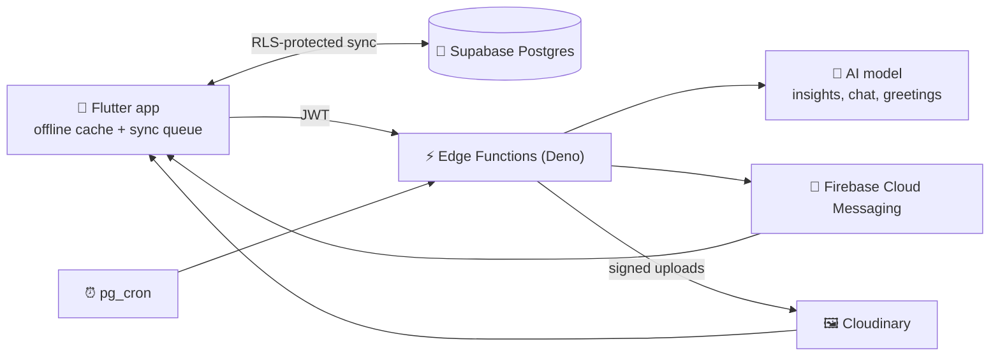

<div align="center">


# Kharcha खर्च

### The money app that speaks Nepali, knows the tithi, and has feelings about your spending.

[](https://github.com/nischalsir/kharcha/releases/latest)
[](https://flutter.dev)
[](https://supabase.com)
[](https://firebase.google.com)
[](https://cloudinary.com)

**[⬇️ Download the latest APK](https://github.com/nischalsir/kharcha/releases/latest)** · [What's new](https://github.com/nischalsir/kharcha/releases) · [Run it yourself](#-run-it-yourself)

<br>

| Home | Calendar | Sign in | Sign up |
|:---:|:---:|:---:|:---:|
|  |  |  |  |

</div>

---

## 🔥 Meet the Flame

Most expense trackers show you a number. Kharcha has a little flame that **lives on your balance card and reacts to your money**.

- **It eats your savings.** Its size and colour follow how much of this month's income you've kept: tall and glowing gold when you're saving, cooling to a small blue flicker when spending overtakes income.
- **It talks back.** Log income and your phone buzzes with *"Hmmmm… money! 🤑"*. Drop a big spend and you get *"Save money, please! 😱"*. Reactions arrive as real push notifications, not pop-ups in your face.
- **It has ten faces.** Happy, excited, calm, worried, sad, sleepy after 11 pm, 😍 heart eyes for a salary-sized income, 😱 shocked at a huge purchase, a 😉 wink when you log a small one, and 🤔 thinking when it has advice.
- **It gives real advice.** Tips are built from *your* numbers: *"Most of your money went to Food (रु 8,200). Try a small limit on it this week."*
- **It says good morning.** An AI-written greeting at 6 am, good night at 10 pm, and a couple of surprise tips in between. You can switch them off in Settings.

## 🗓️ A calendar that actually knows Nepal

- **Bikram Sambat first.** Dates, months and numerals in Nepali, with English whenever you want it.
- **Tithi for every single day.** Worked out from the actual positions of the Sun and Moon at Kathmandu sunrise, the way the panchang does it. Ekadashi, Purnima and Aunsi are highlighted.
- **60+ festivals and observances**, from Dashain and Tihar to Kushe Aunsi, Nag Panchami, Guru Purnima and Dahi Chiura Khane Din, with public holidays marked.
- **Real festival photos**, freely licensed and credited, served at the right size for your screen.
- **Festival reminders** for today's and tomorrow's festivals when you open the app.

## 💰 Money that makes sense at a glance

- **Log in seconds.** Expenses and income with categories, eSewa / Khalti / bank / cash, notes and dates.
- **"Spent this month"** shows the total, the share of your income it ate, and your top three categories on one bar.
- **Monthly budget** with a progress bar that turns amber at 80% and red when you go over.
- **Reports** with monthly charts and category breakdowns.
- **Bank statement import.** Drop in a PDF statement and review the parsed entries before saving.
- **Recurring payments** for rent, subscriptions and anything else that comes back every month.

## 🤝 Friends & Pasal

- **Who owes whom:** track money you lent or borrowed, with partial payments and overdue nudges.
- **Pasal khata:** keep your local shop's credit book, item by item, and record what you've paid off.

## 🔐 Your data, locked down

- **Offline-first.** Everything works without internet and syncs when you're back online.
- **Every row is yours alone.** Row-level security on every table; the database itself refuses to show your data to anyone else.
- **No secrets in the app.** AI, Firebase and Cloudinary keys live only in server functions. Uploads are signed per user on the server.
- **Fingerprint sign-in**, authenticator-app 2FA, and backups to the cloud or a file.
- **Try it as a guest.** When you're ready, *Save your data* turns the guest account into a real one without losing a single entry.

---

## 🧱 How it's built



| Layer | What's used |
|---|---|
| App | Flutter · Dart · Provider |
| Data | Supabase Postgres with row-level security, offline cache with a sync queue |
| Server | Supabase Edge Functions (Deno) + `pg_cron` for scheduled jobs |
| Push | Firebase Cloud Messaging (HTTP v1) |
| Images | Cloudinary (`f_auto`, `q_auto`, face-aware avatar crops) |
| Auth | Supabase Auth: email + password, TOTP 2FA, anonymous guests |

<details>
<summary><b>Edge Functions</b></summary>

| Function | What it does | Trigger |
|---|---|---|
| `ai-insight` | Home-screen insight and chat, grounded in your own summary | App |
| `ai-daily-buddy` | Good morning / good night / daytime tips, in each user's local time | `pg_cron`, every 15 min |
| `ai-push-digest` | Important-only AI alerts, with cooldowns and dedupe | `pg_cron`, daily |
| `send-push` | Delivers FCM notifications (including the flame's reactions) | App / server |
| `register-push-token` | Registers a device for push | App |
| `media-sign` | Signs Cloudinary uploads for the signed-in user | App |
| `parse-statement` | Reads bank statement PDFs | App |

</details>

<details>
<summary><b>Project layout</b></summary>

```
lib/
  core/          theme, routing, l10n, utilities
  models/        data models
  providers/     app state (Provider)
  repositories/  data access over the offline cache
  screens/       UI
  services/      sync, tithi, AI mood, notifications, Cloudinary
  widgets/       shared components (flame mascot, glass cards, …)
supabase/
  functions/     Edge Functions + shared modules + Deno tests
  migrations/    SQL schema, RLS, cron jobs
test/            Flutter tests
tool/            run/build wrappers, festival image fetcher
```

</details>

---

## 🚀 Run it yourself

**1. Configure.** Copy `.env.example` to `.env` and fill in `SUPABASE_URL` and `SUPABASE_ANON_KEY` (Supabase → Project Settings → API).

**2. Run through the wrapper.** It passes `.env` to the app as `--dart-define` values and keeps server-only keys out of the build:

```powershell
.\tool\run.ps1            # Windows: run on a device
.\tool\run.ps1 build apk  # Windows: release APK
```

```bash
./tool/run.sh             # macOS / Linux
./tool/run.sh build apk
```

> Plain `flutter run` also starts, but without a backend. Sync will say *"Backend is not configured"*.

**3. Backend (optional).** Apply `supabase/migrations/`, deploy `supabase/functions/`, and set the function secrets you need: AI key, `FIREBASE_SERVICE_ACCOUNT_JSON`, `CLOUDINARY_URL`.

**4. Test.**

```bash
flutter test                              # app
deno test --allow-net supabase/functions  # server
```

---

## 📦 Installing the APK

Grab `kharcha-vX.Y.Z.apk` from **[Releases](https://github.com/nischalsir/kharcha/releases/latest)**, allow *Install unknown apps* for your browser or file manager, and open it. The app checks for new releases on sign-in and tells you when an update is out.

> Builds are currently signed with the development key. If you installed a copy signed differently, uninstall it first; Android refuses updates across signing keys.

---

## 🙏 Credits

- Festival dates from Nepal's published calendar; tithi computed with the algorithms in Jean Meeus, *Astronomical Algorithms*.
- Festival photographs from Wikimedia Commons contributors under free licences, credited in the app and in [`ATTRIBUTION.md`](assets/images/festivals/ATTRIBUTION.md).

<div align="center">

**Built by [Nischal Pandey](https://github.com/nischalsir)** · [Instagram](https://instagram.com/nischalsir)

*If Kharcha helped you save a rupee, a ⭐ helps the flame glow.*

</div>
