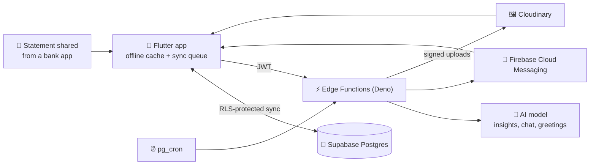

<div align="center">


# Kharcha खर्च

### The money app that speaks Nepali, knows the tithi, and has feelings about your spending.

[](https://github.com/nischalsir/kharcha/releases/latest)
[](https://flutter.dev)
[](https://supabase.com)
[](https://firebase.google.com)
[](https://cloudinary.com)

**[⬇️ Download the latest APK](https://github.com/nischalsir/kharcha/releases/latest)** · [What's new](https://github.com/nischalsir/kharcha/releases) · [Run it yourself](#-run-it-yourself)

<br>

| Home | Calendar | Sign in | Sign up |
|:---:|:---:|:---:|:---:|
|  |  |  |  |

</div>

---

## 🔥 Meet Flamey

Most expense trackers show you a number. Kharcha has a little flame called Flamey that **lives on your balance card and reacts to your money**.

- **It eats your savings.** Its size and colour follow how much of this month's income you've kept: tall and glowing gold when you're saving, cooling to a small blue flicker when spending overtakes income.
- **It is alive.** Tap it, hold it or swipe it and it reacts. Left alone it glances around, it thinks while the AI is writing, and it wears the face of whatever it is saying.
- **It has more than twenty faces.** Happy, proud, curious, confused, sleepy, bored, 😍 in love with a salary-sized income, 😱 shocked at a huge purchase, a 😉 wink for a small one, grumpy when you overspend and starstruck when you hit a goal.
- **It talks back.** Log income and your phone buzzes with *"Hmmmm… money! 🤑"*. Drop a big spend and you get *"Save money, please! 😱"*. Reactions arrive as real push notifications, not pop-ups in your face.
- **It knows your habits.** Repeated purchases, small buys adding up, a category that suddenly jumped, a good saving streak. It says so plainly, playfully, or with a friendly roast (only ever of the spending).
- **Suggestions arrive on their own.** Morning, midday, evening and end of day, a weekly look-back on Saturday evening and a monthly one three times a month, plus whenever you add, edit or delete a transaction or change a budget. There is no refresh button.
- **Every figure is yours.** Suggestions are written on your phone from your own records. When the AI is asked, the server throws away any reply that quotes an amount or percentage that is not in your data.
- **It says good morning.** An AI-written greeting at 6 am, good night at 10 pm, and a couple of surprise tips in between. You can switch them off in Settings.

## 🗓️ A calendar that actually knows Nepal

- **Bikram Sambat first.** Dates, months and numerals in Nepali, with English and the Gregorian calendar whenever you want them.
- **Tithi for every single day.** Worked out from the actual positions of the Sun and Moon at Kathmandu sunrise, the way the panchang does it. Ekadashi, Purnima and Aunsi are highlighted.
- **60+ festivals and observances**, from Dashain and Tihar to Kushe Aunsi, Nag Panchami, Guru Purnima and Dahi Chiura Khane Din, with public holidays marked.
- **Real festival photos**, freely licensed and credited, served at the right size for your screen and kept on the phone so they open instantly.
- **Festival reminders** for today's and tomorrow's festivals when you open the app.

## 💰 Money that makes sense at a glance

- **Log in seconds.** Expenses and income with categories, eSewa / Khalti / bank / cash, notes and dates.
- **"Spent this month"** shows the total, the share of your income it ate, and your top three categories on one bar.
- **Budgets** for the month and for each category, with a progress bar that turns amber at 80% and red when you go over.
- **Reports** with monthly charts and category breakdowns.
- **Recurring payments** for rent, subscriptions and anything else that comes back every month.
- **Calculator** built in, for the sums you'd otherwise leave the app to do.
- **Pull to refresh** on every page that shows your data.

## 📄 Statement import

- **Bank, eSewa, Khalti or another wallet.** Just choose the file: Kharcha works out whose statement it is from the file itself. Each source has a step-by-step guide for downloading it.
- **PDF, Excel and CSV.** Bank PDFs are read by their column headings, not by one bank's layout, so statements from many Nepali banks work.
- **Checked, not guessed.** Rows are checked against the statement's own running balance. Rows and pages that cannot be read are listed for you instead of being filled in.
- **Bikram Sambat dates are converted**, and entries you already have are spotted as duplicates.
- **Share straight into Kharcha.** In your bank app or file manager, tap *Share* or *Open with* on a statement and choose Kharcha. It opens in the importer.
- **You review every row** before anything is saved, with *Select all* to tick or untick them at once. The statement file itself is never stored.

## 🤝 Friends & Pasal

- **Who owes whom:** track money you lent or borrowed, with partial payments and overdue nudges.
- **Pasal khata:** keep your local shop's credit book, item by item with photos, and record what you've paid off.

## 🔔 Reminders that matter

Budget alerts, upcoming bills, friend debts, overdue payments, the pasal month end, and daily or weekly summaries, all sent in your own local time and following the Bikram Sambat calendar.

## 🔐 Your data, locked down

- **Offline-first.** Everything works without internet and syncs when you're back online.
- **Every row is yours alone.** Row-level security on every table; the database itself refuses to show your data to anyone else. Accounts sharing one phone are kept apart too.
- **No secrets in the app.** AI, Firebase and Cloudinary keys live only in server functions. Uploads are signed per user on the server.
- **Fingerprint sign-in**, authenticator-app 2FA, and password reset with a code sent to your email.
- **Backups** to the cloud, to a file you can keep or share, or to your own Google Drive (Drive needs a one-time setup, see [`docs/google-drive-setup.md`](docs/google-drive-setup.md)).
- **Guest mode.** Explore without an account, then *Save your data* turns the guest into a real account without losing an entry. It needs anonymous sign-ins switched on in the backend; the app tells you when it is off.
- **Updates from inside the app.** Kharcha checks GitHub Releases and offers the new version when one is out.

---

## 🧱 How it's built



| Layer | What's used |
|---|---|
| App | Flutter · Dart · Provider · Android 7.0+ |
| Data | Supabase Postgres with row-level security, offline cache with a sync queue |
| Server | Supabase Edge Functions (Deno) + `pg_cron` for scheduled jobs |
| AI | Any OpenAI-compatible endpoint (NVIDIA by default), called only from the server |
| Push | Firebase Cloud Messaging (HTTP v1, data-only messages) |
| Images | Cloudinary (`f_auto`, `q_auto`, face-aware avatar crops), with an on-disk cache |
| Auth | Supabase Auth: email + password, TOTP 2FA, anonymous guests |
| Weather | Open-Meteo, no key needed, used as an accent on the mood card |

<details>
<summary><b>Edge Functions</b></summary>

| Function | What it does | Trigger |
|---|---|---|
| `ai-insight` | Home-screen suggestions and chat, grounded in your own summary | App |
| `ai-daily-buddy` | Good morning / good night / daytime tips, in each user's local time | `pg_cron`, every 15 min |
| `ai-push-digest` | Important-only AI alerts, with cooldowns and dedupe | `pg_cron`, daily |
| `push-reminders` | Budget alerts, upcoming bills, friend debts, overdue payments, pasal month end, daily/weekly summaries | `pg_cron`, hourly |
| `send-push` | Delivers FCM notifications (including Flamey's reactions) | App / server |
| `register-push-token` | Registers a device for push | App |
| `media-sign` | Signs Cloudinary uploads for the signed-in user | App |
| `parse-statement` | Reads bank and wallet statements (PDF, Excel, CSV) | App |

</details>

<details>
<summary><b>Project layout</b></summary>

```
lib/
  core/          config, theme, routing, l10n, utilities
  data/          generated festival image credits
  models/        data models
  providers/     app state (Provider)
  repositories/  data access over the offline cache
  screens/       UI
  services/      sync, tithi, Flamey, suggestions, statement import, push, backups
  widgets/       shared components (Flamey, glass cards, …)
android/         share-sheet and "Open with" handling for statements
supabase/
  functions/     Edge Functions + shared modules + Deno tests
  migrations/    incremental SQL: schema changes, RLS, cron jobs
docs/            Google Drive setup, Play Protect notes, integration audit
test/            Flutter tests
tool/            run, build and release scripts, festival image fetcher
```

</details>

---

## 🚀 Run it yourself

**1. Configure.** Copy `.env.example` to `.env` and fill in `SUPABASE_URL` and `SUPABASE_ANON_KEY` (Supabase → Project Settings → API). `WEATHER_LAT` / `WEATHER_LON` and `GOOGLE_SERVER_CLIENT_ID` are optional.

**2. Run through the wrapper.** It passes `.env` to the app as `--dart-define` values and keeps server-only keys out of the build:

```powershell
.\tool\run.ps1            # Windows: run on a device
.\tool\run.ps1 build apk  # Windows: release APK
```

```bash
./tool/run.sh             # macOS / Linux
./tool/run.sh build apk
```

> Plain `flutter run` also starts, but without a backend. Sync will say *"Backend is not configured"*.

**3. Backend (optional).** Deploy `supabase/functions/` and set the function secrets you need:

| Secret | For |
|---|---|
| `NVIDIA_API_KEY` or `AI_API_KEY` | AI suggestions, chat and greetings. `AI_API_BASE_URL` and `AI_MODEL` are optional overrides. |
| `FIREBASE_SERVICE_ACCOUNT_JSON` | Push notifications |
| `CLOUDINARY_URL` | Profile pictures on Cloudinary. Without it they fall back to Supabase Storage. |

`supabase/migrations/` holds incremental changes only, not the original schema; see [`supabase/migrations/README.md`](supabase/migrations/README.md) before applying them to an empty database. Guest mode needs *Allow anonymous sign-ins* turned on in Supabase Auth.

**4. Test.**

```bash
flutter analyze lib test && flutter test                              # app
cd supabase && deno test --allow-net=0.0.0.0 functions/_tests         # server
```

**5. Release.** `.\tool\release.ps1 -Notes notes.md` builds the signed APK and App Bundle, tags the version from `pubspec.yaml` and publishes the GitHub release that installed apps check for updates. It needs the release key in `android/key.properties`.

---

## 📦 Installing the APK

Grab `kharcha-vX.Y.Z.apk` from **[Releases](https://github.com/nischalsir/kharcha/releases/latest)**, allow *Install unknown apps* for your browser or file manager, and open it. After that, the app tells you when an update is out.

> Releases are signed with Kharcha's own release key (since v1.0.8). Because the app is installed from an APK and not from Google Play, Play Protect may warn about it; [`docs/play-protect.md`](docs/play-protect.md) explains why. If you still have a build from v1.0.7 or earlier, uninstall it first: Android refuses updates across signing keys.

---

## 🙏 Credits

- Festival dates from Nepal's published calendar; tithi computed with the algorithms in Jean Meeus, *Astronomical Algorithms*.
- Festival photographs from Wikimedia Commons contributors under free licences, credited in the app and in [`ATTRIBUTION.md`](assets/images/festivals/ATTRIBUTION.md).

<div align="center">

**Built by [Nischal Pandey](https://github.com/nischalsir)** · [Instagram](https://instagram.com/nischalsir)

*If Kharcha helped you save a rupee, a ⭐ helps the flame glow.*

</div>
