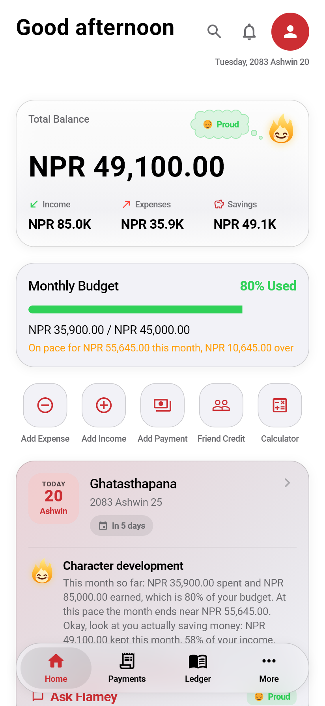
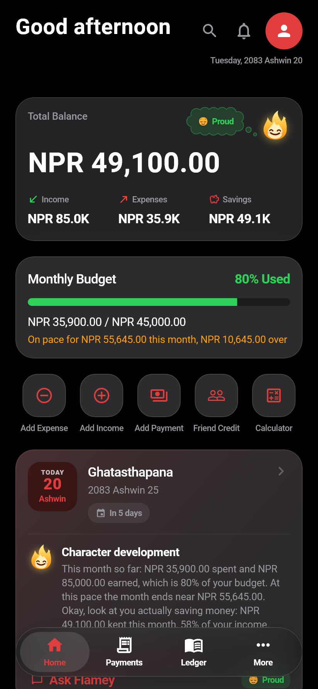
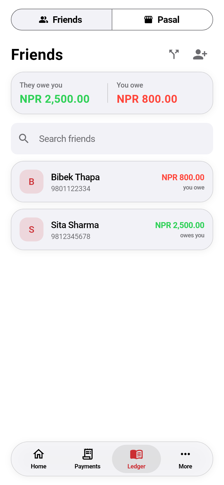
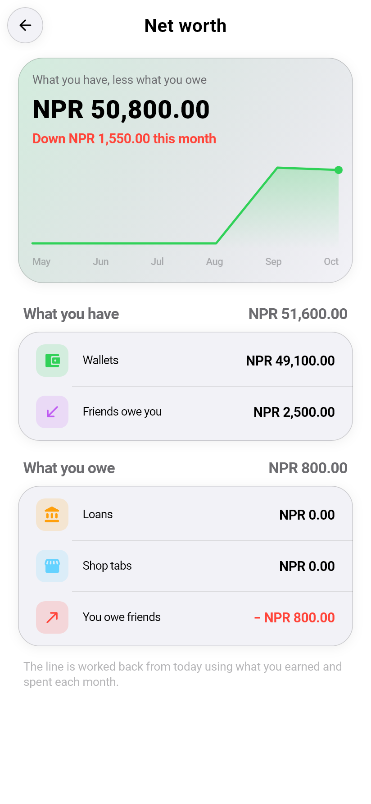
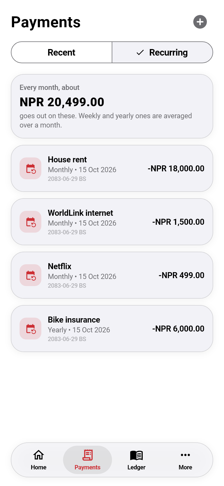
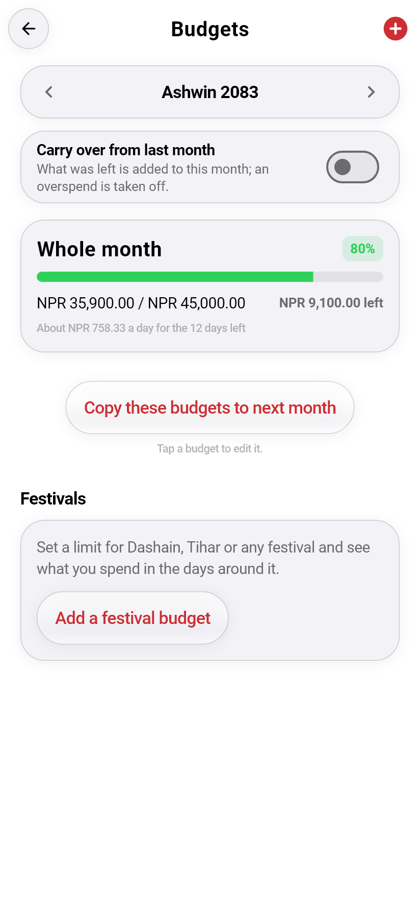
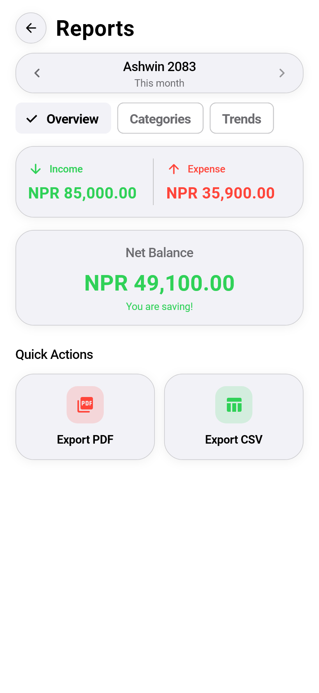
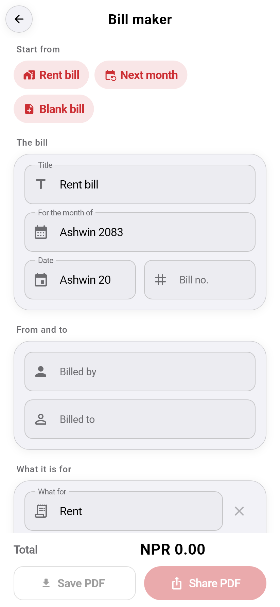
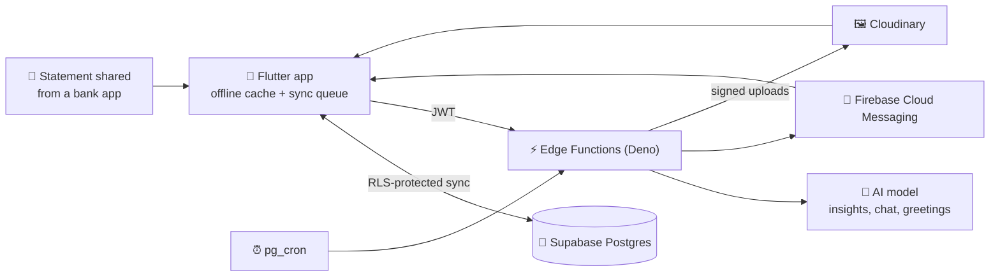

<div align="center">


# Kharcha खर्च

### The money app that speaks Nepali, knows the tithi, and has feelings about your spending.

[](https://github.com/nischalsir/kharcha/releases/latest)
[](https://flutter.dev)
[](https://supabase.com)
[](#-install)

**[⬇️ Download the latest APK](https://github.com/nischalsir/kharcha/releases/latest)** · [What's new](https://github.com/nischalsir/kharcha/releases) · [Run it yourself](#-run-it-yourself)

<br>

| Home | Dark mode | Ledger | Net worth |
|:---:|:---:|:---:|:---:|
|  |  |  |  |

</div>

---

Kharcha is an expense tracker made for Nepal. It keeps dates in Bikram Sambat, counts in rupees the way you write them, remembers the shop that lets you pay at the end of the month, and works with no internet. A small flame called **Flamey** lives on your balance and tells you, kindly or not, how the month is going.

It is free, has no ads, and is installed from an APK.

## 🔥 Flamey

- **Lives on your balance card.** Its size and colour follow how much of this month's income you have kept: tall and gold when you are saving, a small blue flicker when spending overtakes income.
- **Thinks out loud.** Its mood drifts up as a thought bubble, fades, and comes back. Touch Flamey to bring it back sooner; tap the thought to see what the mood means.
- **Reacts to what you do.** More than twenty faces: proud, curious, sleepy, shocked at a huge purchase, a wink for a small one, starstruck when you hit a goal.
- **Knows your habits.** Repeated purchases, small buys adding up, a category that suddenly jumped, a good saving streak. Every figure it quotes comes from your own records; the server throws away any AI reply that names an amount that is not in your data.
- **Ask it anything** about your money in a chat.

## 💰 Money at a glance

- **Log in seconds**: expense or income, category, cash / bank / eSewa / Khalti / card / QR, a note, a receipt photo. Or say it out loud.
- **Budgets** for the month, per category and per festival, with last month's leftover carried over if you want. Home shows where the month is heading at the pace so far.
- **Recurring payments** for rent, internet and subscriptions, with what they come to in a month.
- **Reports** for this month or any month before: charts, category breakdown, trends, and a PDF or CSV to keep.
- **Net worth**: wallets, what friends owe you, loans, shop tabs and what you owe, on one page.
- **Savings goals, wallets with transfers, loans with EMI**, and a **household ledger** shared with family.
- **Bill maker**: write a rent, water or electricity bill and share it as a PDF.
- **Undo**: a deleted transaction can be brought straight back.

<div align="center">

| Recurring | Budgets | Reports | Bill maker |
|:---:|:---:|:---:|:---:|
|  |  |  |  |

</div>

## 🤝 Ledger: friends and shops

- **Friends**: money lent and borrowed, part payments, due dates, overdue nudges, and splitting a bill.
- **Pasal khata**: your local shop's credit book, item by item with photos, and what you have paid off.
- **Payment QR**: save a shop's or a friend's QR once and open it full screen whenever you pay.
- **Numbers from your contacts** without a contacts permission: only the one you pick is read.

## 🗓️ A calendar that knows Nepal

- **Bikram Sambat first**, in Nepali or English, with the Gregorian date whenever you want it.
- **Tithi for every day**, worked out from the positions of the Sun and Moon at Kathmandu sunrise, the way a panchang does it.
- **60+ festivals and observances**, public holidays marked, with freely licensed photos.

## 📄 Import instead of typing

- **Statements** from a bank, eSewa or Khalti, as PDF, Excel or CSV. Rows are checked against the statement's own running balance, Bikram Sambat dates are converted, and duplicates are spotted.
- **Payment messages**: copy the SMS your bank sent and paste it in.
- **Share into Kharcha** from your bank app or file manager.
- **You review every row** before anything is saved. The file itself is never kept.

## 🔔 Notifications

Budget alerts, upcoming bills, friend debts, overdue payments, the pasal month end, a report on the first day of each month, and Flamey's good morning and good night, all in your local time and on the Bikram Sambat calendar. Each kind has its own switch.

## 🔐 Private by design

- **Works offline.** Everything is saved on the phone first and synced when you are back online.
- **Your rows are yours.** Row-level security on every table: the database itself refuses to show your data to another account.
- **Asks for very little.** No SMS, contacts, storage or install-apps permission. Notifications and approximate location (for the weather) are optional.
- **No secrets in the app.** AI and messaging keys live only on the server.
- **Fingerprint sign-in, an app lock, and two-factor sign-in** with an authenticator app.
- **Guest mode**: try everything without an account, then keep what you added when you make one.
- **Backups** to your account or to a file you can keep anywhere.
- **Leave whenever you like.** *Settings > Delete account* removes the account, everything synced for it and every picture kept for it.

---

## 📦 Install

1. Download `kharcha-vX.Y.apk` from **[Releases](https://github.com/nischalsir/kharcha/releases/latest)**.
2. Allow *Install unknown apps* for your browser or file manager, and open the file.
3. If Google Play Protect says it has not seen this app before, choose **Scan app**. It asks that of any APK file that is new to Google, and every release is a new file. [`docs/play-protect.md`](docs/play-protect.md) explains it.

Needs Android 7.0 or later. When a new version is out the app tells you, and *Download update* opens it in your browser; open the downloaded file to install it over the old one.

> Releases are signed with Kharcha's own key. If you still have a build from v1.0.7 or earlier, uninstall it first: Android refuses an update signed with a different key.

---

## 🧱 How it's built



| Layer | What's used |
|---|---|
| App | Flutter · Dart · Provider · Android 7.0+ |
| Data | Supabase Postgres with row-level security; an offline cache with a sync queue on the phone |
| Server | Supabase Edge Functions (Deno) and `pg_cron` for scheduled jobs |
| AI | Any OpenAI-compatible endpoint (NVIDIA by default), called only from the server |
| Push | Firebase Cloud Messaging (HTTP v1). Android draws the notification itself, so the app does not have to be running |
| Files | A private Supabase Storage folder per account for receipts, item pictures and payment QRs |
| Images | Cloudinary for festival photos and profile pictures, with an on-disk cache |
| Auth | Supabase Auth: email and password, TOTP two-factor, local guest mode |
| Weather | Open-Meteo, no key needed |

<details>
<summary><b>Edge Functions</b></summary>

| Function | What it does | Called by |
|---|---|---|
| `ai-insight` | Home suggestions and chat, grounded in your own summary, with a daily allowance per account | App |
| `ai-daily-buddy` | Good morning, good night and daytime nudges, in each user's local time | `pg_cron`, every 15 min |
| `ai-push-digest` | Important-only AI alerts, with cooldowns and dedupe | `pg_cron`, daily |
| `push-reminders` | Budget alerts, bills, friend debts, overdue payments, pasal month end, summaries and the monthly report | `pg_cron`, hourly |
| `send-push` | Delivers a notification to the caller's own devices | App / server |
| `admin-push` | Announcements from the operator's push console, with pictures | Push console / `pg_cron` |
| `register-push-token` | Registers a device for push | App |
| `media-sign` | Signs Cloudinary uploads for the signed-in user | App |
| `parse-statement` | Reads bank and wallet statements (PDF, Excel, CSV) | App |
| `delete-account` | Deletes the caller's own account, data and files | App |

</details>

<details>
<summary><b>Project layout</b></summary>

```
lib/
  core/          config, theme, routing, l10n, utilities
  data/          generated festival image credits
  models/        data models
  providers/     app state (Provider)
  repositories/  data access over the offline cache
  screens/       UI, one folder per page
  services/      sync, tithi, Flamey, suggestions, statement import, push, backups
  widgets/       shared components (Flamey, glass cards, …)
android/         share-sheet and "Open with" handling, home-screen widgets
supabase/
  functions/     Edge Functions, shared modules and Deno tests
  migrations/    incremental SQL: schema changes, RLS, cron jobs
docs/            screenshots, Play Protect notes, integration audit
test/            Flutter tests
tool/            run, build and release scripts, festival image fetcher
```

</details>

## 🚀 Run it yourself

**1. Configure.** Copy `.env.example` to `.env` and fill in `SUPABASE_URL` and `SUPABASE_ANON_KEY` (Supabase → Project Settings → API). `WEATHER_LAT` / `WEATHER_LON` are optional.

**2. Run through the wrapper.** It passes `.env` to the app as `--dart-define` values and keeps server-only keys out of the build:

```powershell
.\tool\run.ps1            # Windows: run on a device
.\tool\run.ps1 build apk  # Windows: release APK
```

```bash
./tool/run.sh             # macOS / Linux
./tool/run.sh build apk
```

> Plain `flutter run` also starts, but without a backend. Sync will say *"Backend is not configured"*.

**3. Backend (optional).** Deploy `supabase/functions/` and set the function secrets you need:

| Secret | For |
|---|---|
| `NVIDIA_API_KEY` or `AI_API_KEY` | AI suggestions, chat and greetings. `AI_API_BASE_URL` and `AI_MODEL` are optional overrides. |
| `FIREBASE_SERVICE_ACCOUNT_JSON` | Push notifications |
| `CLOUDINARY_URL` | Profile pictures on Cloudinary. Without it they fall back to Supabase Storage. |

`supabase/migrations/` holds incremental changes only, not the original schema; see [`supabase/migrations/README.md`](supabase/migrations/README.md) before applying them to an empty database.

**4. Test.**

```bash
flutter analyze && flutter test                       # app
cd supabase/functions && deno test -A _tests          # server
```

**5. Release.** `.\tool\release.ps1 -Notes notes.md` builds the signed APK and App Bundle, tags the version from `pubspec.yaml` and publishes the GitHub release that installed apps check for updates. It needs the release key in `android/key.properties`.

---

## 🙏 Credits

- Festival dates from Nepal's published calendar; tithi computed with the algorithms in Jean Meeus, *Astronomical Algorithms*.
- Festival photographs from Wikimedia Commons contributors under free licences, credited in the app and in [`ATTRIBUTION.md`](assets/images/festivals/ATTRIBUTION.md).
- The screenshots above are the app's real screens, drawn with sample data.

<div align="center">

**Built by [Nischal Pandey](https://github.com/nischalsir)** · [Instagram](https://instagram.com/nischalsir)

*If Kharcha helped you save a rupee, a ⭐ helps the flame glow.*

</div>
